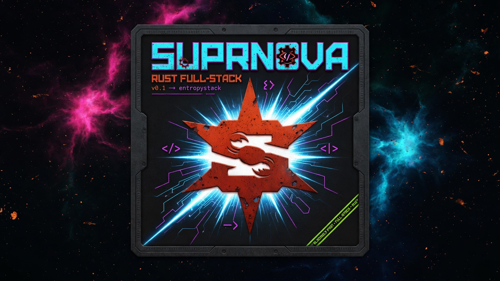

# Pulsar

Pulsar is a [Suprnova](https://github.com/entrepeneur4lyf/suprnova) starter kit
for shipping a product site with account management, generated documentation,
articles, RSS, role-gated authoring, and a Vue/Vuetify frontend. It is intended
to be the source kit for downstream apps such as `suprnova.app`.

### Part of the Suprnova kit family

Pulsar is the full product-site kit. Want just authentication?
**[Nebula](https://github.com/entrepeneur4lyf/Nebula)** is the Breeze-tier kit —
register, email verification, login, password reset, and profile management on
Inertia 3 + Svelte 5. See every kit in the
[Suprnova manual](https://github.com/entrepeneur4lyf/suprnova/blob/main/manual/starter-kits.md).

## Stack

- Rust 2024, Suprnova, Tokio, SeaORM, SQLite by default.
- Vue 3, Inertia, Vuetify, Vite, and Bun for frontend tooling.
- Markdown content rendered through Suprnova content helpers.
- Integration tests drive the real HTTP router through an ephemeral loopback
  server.

## Local Setup

Copy `.env.example` to `.env`, then generate an app key before running outside
local test mode. Copy the generated value into `APP_KEY`:

```bash
cp .env.example .env
openssl rand -base64 32 | tr '+/' '-_' | tr -d '='
```

Default development ports are intentionally uncommon:

- Backend: `http://localhost:8765`
- Vite: `http://localhost:5765`

Run both development servers through the Suprnova CLI:

```bash
suprnova serve --port 8765 --frontend-port 5765
```

Or run the backend and frontend in separate terminals:

```bash
cargo run --bin pulsar
cd frontend && bun run dev -- --host 127.0.0.1 --port 5765
```

## Content Workflows

Documentation lives in `content/docs/*.md` and is compiled to
`storage/content/docs`:

```bash
cargo run --bin console -- docs:build
```

Articles are stored in the database. Seed release examples with:

```bash
cargo run --bin console -- articles:seed
```

Promote users for authoring with:

```bash
cargo run --bin console -- users:promote --email user@example.com --role author
```

## Auth and Authoring

Registration sends an email verification link. Verified users can access
`/dashboard` and `/profile`; unverified users are held at `/verify-email`.
Members cannot access article authoring. Users with the `author` or `admin`
role can use `/admin/articles`, create drafts, publish articles, and feed
published content to `/blog` and `/feed.xml`.

Admins also get two management surfaces, each gated by a permission and
fail-closed for everyone else: `/admin/users` is a member directory showing
each account's verification state and assigned roles, and `/moderation` is a
review queue of draft articles awaiting publication.

## Verification Gates

Run these before handing work off:

```bash
cargo run --bin console -- docs:build
cargo run --bin console -- articles:seed
cargo test
cd frontend && bun run check && bun run build
```

## Key Routes

- Public: `/`, `/docs`, `/docs/getting-started`, `/blog`, `/blog/{slug}`,
  `/feed.xml`
- Guest auth: `/login`, `/register`, `/forgot-password`, `/reset-password`
- Authenticated: `/dashboard`, `/profile`, `/verify-email`
- Authoring: `/admin/articles`, `/admin/articles/create`,
  `/admin/articles/{id}/edit`
- Admin: `/admin/users` (member directory), `/moderation` (draft review queue)
